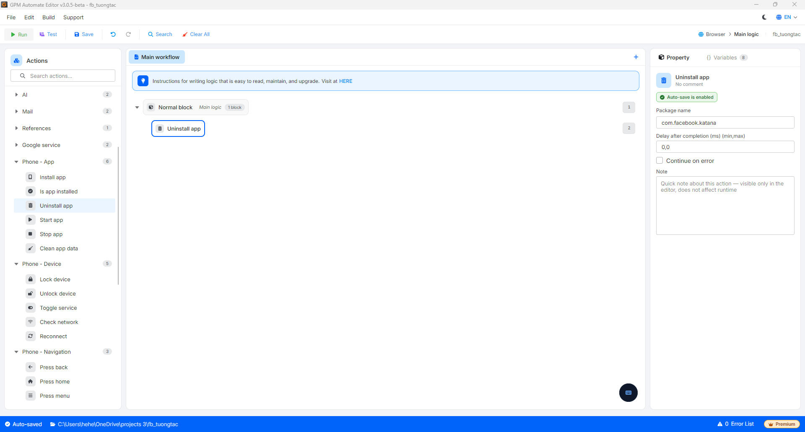

# Uninstall app

Uninstall app là hành động gỡ bỏ hoàn toàn một ứng dụng khỏi thiết bị điện thoại theo tên gói.

#### Giải thích các tham số cấu hình:

* Package name: Tên gói của ứng dụng cần gỡ, ví dụ `com.facebook.katana`.

<figure><figcaption></figcaption></figure>
