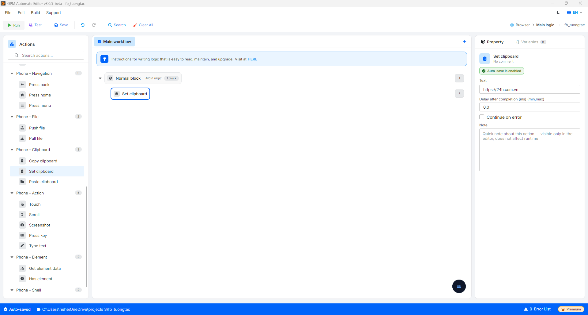

# Set clipboard

Set clipboard là hành động ghi một đoạn văn bản vào bộ nhớ tạm (clipboard) của thiết bị, để sau đó dán (paste) vào ô nhập liệu.

#### Giải thích các tham số cấu hình:

* Text: Nội dung văn bản cần đưa vào clipboard, ví dụ `https://24h.com.vn`. Có thể nhập trực tiếp hoặc dùng biến.

<figure><figcaption></figcaption></figure>
