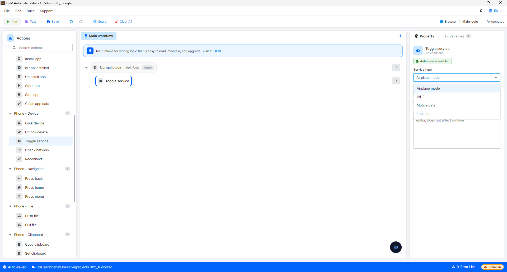

# Toggle service

Toggle service là hành động bật/tắt (chuyển trạng thái) một dịch vụ hệ thống trên thiết bị. Thường dùng để đổi IP nhanh bằng cách bật/tắt Airplane mode hoặc Mobile data.

🎥 Xem thêm video hướng dẫn: [Tại đây](https://youtu.be/CY9salGJqBw).

#### Giải thích các tham số cấu hình:

* Service type: Chọn dịch vụ cần bật/tắt:
  * `Airplane mode`: Chế độ máy bay (ngắt toàn bộ kết nối không dây).
  * `Wi-Fi`: Kết nối Wi-Fi.
  * `Mobile data`: Dữ liệu di động (3G/4G/5G).
  * `Location`: Dịch vụ định vị (GPS).

<figure><figcaption></figcaption></figure>
