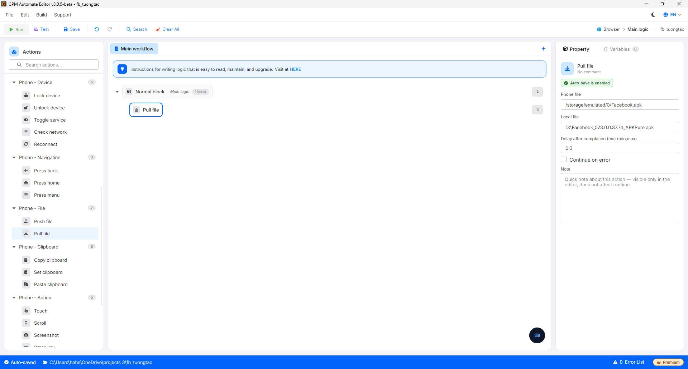

# Pull file

Pull file là hành động sao chép một file từ bộ nhớ thiết bị điện thoại về máy tính (ngược với Push file), ví dụ lấy ảnh chụp màn hình hoặc file kết quả từ điện thoại về.

#### Giải thích các tham số cấu hình:

* Phone file: Đường dẫn file nguồn trên thiết bị, ví dụ `/storage/emulated/0/Facebook.apk`.
* Local file: Đường dẫn đích trên máy tính nơi lưu file, ví dụ `D:\Facebook_573.0.0.37.74_APKPure.apk`.

<figure><figcaption></figcaption></figure>
