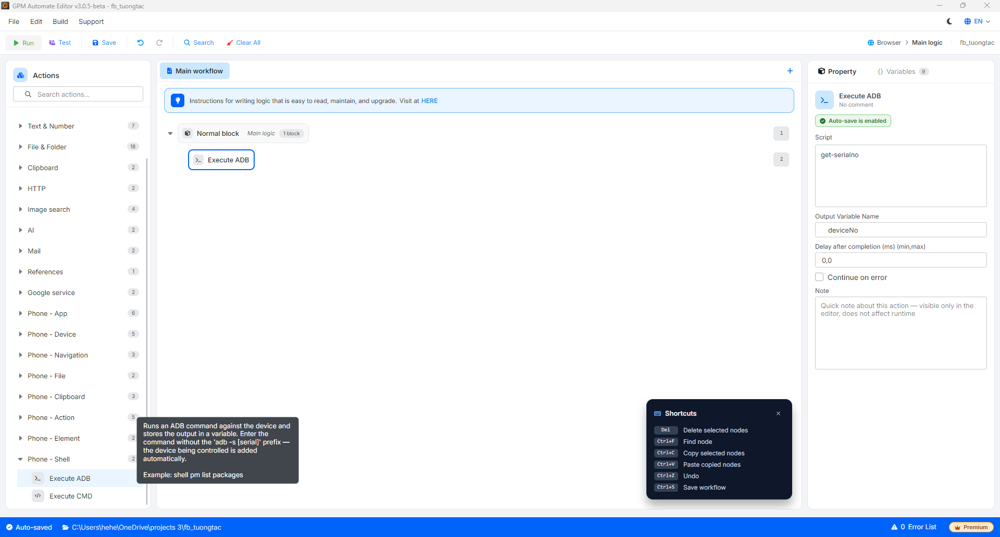

# Execute ADB

Execute ADB là hành động chạy một lệnh ADB nhắm tới thiết bị đang điều khiển và lưu kết quả trả về vào biến. Nhập lệnh mà **không** cần tiền tố `adb -s [serial]` — hệ thống tự thêm thiết bị đang điều khiển vào.

#### Giải thích các tham số cấu hình:

* Script: Lệnh ADB cần chạy (không kèm `adb -s [serial]`), ví dụ `get-serialno` hoặc `shell pm list packages`.
* Output Variable Name: Tên biến lưu kết quả trả về từ lệnh, ví dụ `deviceNo`.

<figure><figcaption></figcaption></figure>
