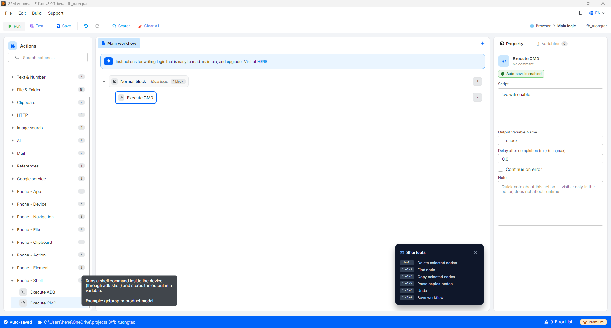

# Execute CMD

Execute CMD là hành động chạy một lệnh shell **bên trong** thiết bị (thông qua `adb shell`) và lưu kết quả trả về vào biến. Khác với Execute ADB (chạy lệnh adb ở phía máy tính), Execute CMD chạy trực tiếp lệnh shell trên hệ điều hành Android của thiết bị.

#### Giải thích các tham số cấu hình:

* Script: Lệnh shell cần chạy trong thiết bị, ví dụ `svc wifi enable` hoặc `getprop ro.product.model`.
* Output Variable Name: Tên biến lưu kết quả trả về, ví dụ `check`.

<figure><figcaption></figcaption></figure>
