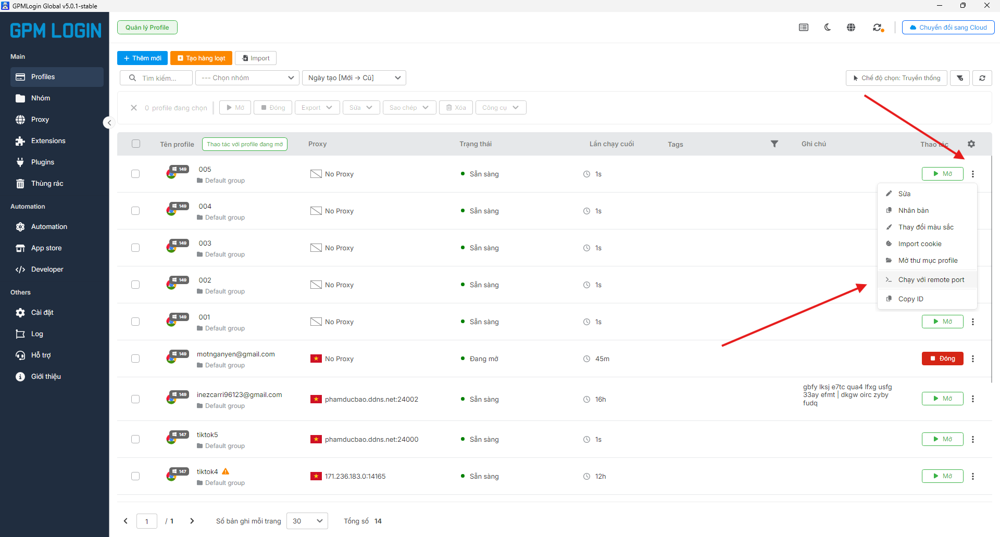
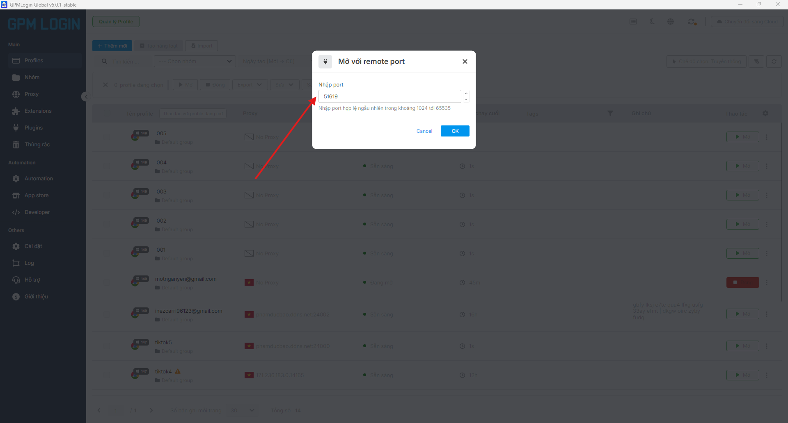
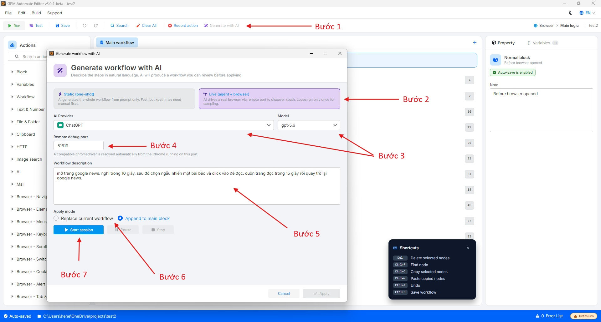

# 🛠️Gen AI Workflow 功能使用指南(通过 AI 生成脚本)

Gen AI Workflow 功能允许您仅通过自然语言描述来创建完整的自动化脚本。简单来说,就是 AI 自动帮您浏览网页——在 GPM Automate 中预先配置好的 AI 会自动读取内容、分析需求,并结合实际浏览网页的 Agent 来分析页面的完整结构,获取如真人操作般精确的 XPath,然后自动生成各种 action 并推送到 workflow 中。

🎥 查看更多视频教程:[点击这里](https://youtu.be/gsLU5H95fl8)。

> 注意:Gen AI Workflow 功能目前支持在 Live 模式下运行时,直接分析 GPM Login 中的 profile。

### ⚙️ Gen AI Workflow 执行流程

要开始通过 AI 创建自动化脚本的过程,请按以下步骤操作:

#### 1️⃣ 第一步:在 GPM Login 中配置 profile

* 打开 GPM Login。
* 找到您想用来测试的 profile。
* 点击 profile 名称旁边的三个点图标。
* 选择"以远程端口运行"以获取控制端口参数。

> 说明:打开远程端口相当于建立一座"桥梁",使 AI 和 GPM Automate 能够直接控制并访问正在打开的浏览器 profile,以实时浏览网页并读取页面结构。

<figure><figcaption></figcaption></figure>

<figure><figcaption></figcaption></figure>

#### 2️⃣ 第二步:在 GPM Automate 中进行设置

* 在 GPM Automate 的工具栏上,选择 **Generate with AI**。
* Gen AI 配置窗口将会显示以下参数:
  * **Remote debug port:** 将第一步中从 GPM Login 获取的端口(Port)粘贴到此栏中,以连接到该 profile。
  * **模式(Mode):**
    * **Static:** 根据脚本自动生成,AI 会自行虚构 XPath,没有 Agent 浏览网页。
    * **Live:** Agent 直接浏览网页,读取页面的完整结构,并获取如真人般精确的 XPath。
  * **AI Provider:** 选择 AI 提供商(**ChatGPT/OpenAI**、**Claude**、**Gemini**、**DeepSeek** 或已在 GPM Automate 的设置部分自行配置的 **Custom AI**),然后选择合适的 **Model**。
  * **Workflow Description:** 输入您想要创建的自然语言指令/脚本描述。
  * **Apply Mode:**
    * **Replace current workflow:** 替换整个当前脚本。
    * **Append to main block:** 将新的 action 追加到主脚本的末尾。
* 点击 **Start session**,浏览器将自动打开并执行脚本分析过程。

<figure><figcaption></figcaption></figure>

#### 3️⃣ 第三步:查看结果

* 浏览器自动运行且系统完成 Generate 过程后,点击 **Apply** 将刚生成的 action 推送到 workflow 中。
* 您可以查看被插入到 GPM Automate 界面中的各个命令块,并进行脚本测试,如有需要可进行微调。
