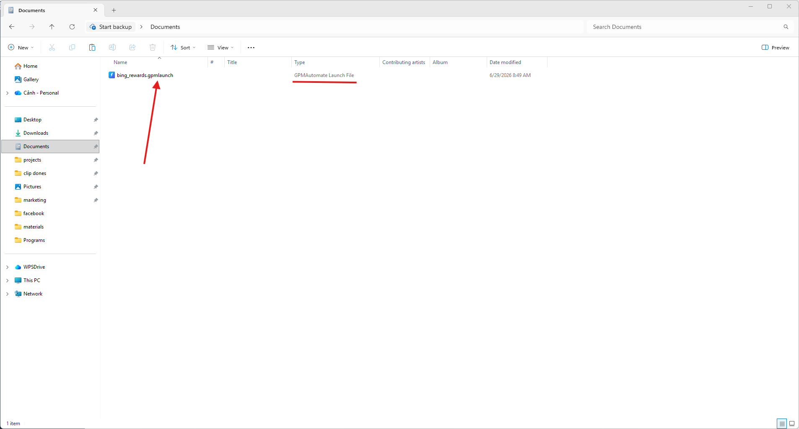

# 📦 1. What is a .gpmlaunch file?

* It is a script running file: You can simply understand that the `.gpmlaunch` file is like a "software file" packaged from the GPM Automate Editor tool. When someone says "run script" or "run tool," they are referring to opening this file.
* Where to get this file: If you are someone who writes scripts yourself, you can build this file for use. If you are a regular user, you can go to the application marketplace [`app.gpmautomate.com`](https://app.gpmautomate.com) to purchase it, or buy directly from service providers who send the file to you.
* Absolute security: This file has been locked and the source code inside is encrypted. Buyers only have the right to run it but cannot view or modify the code, preventing script writers from having their "work" exposed or their intellectual property copied when sold in the market.

<figure><figcaption></figcaption></figure>