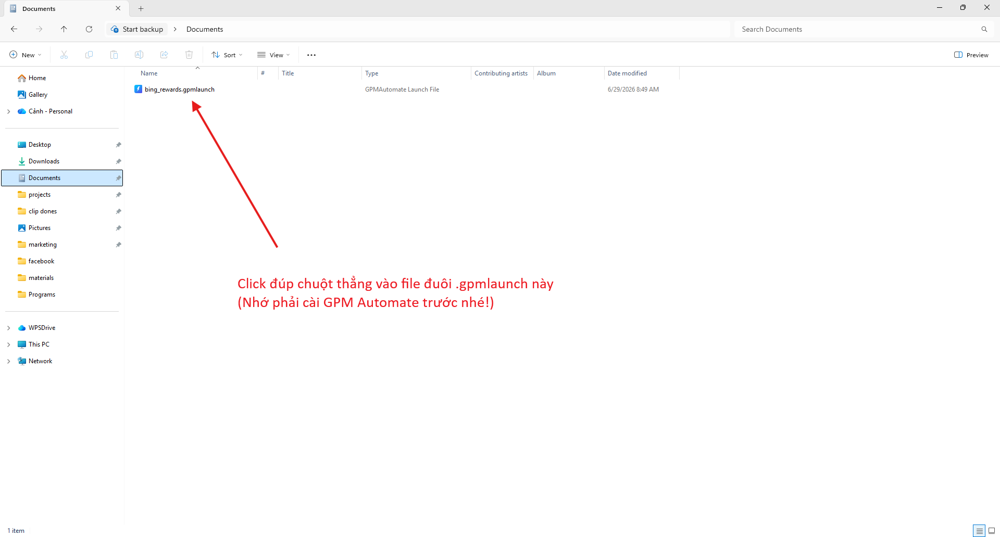
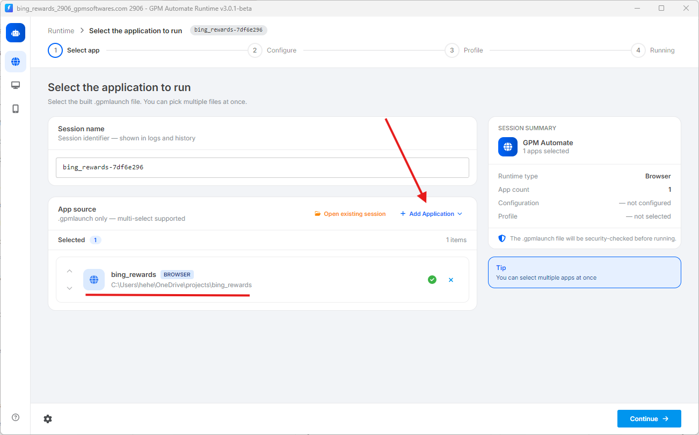

# 🚀 3. 如何打开并运行 .gpmlaunch 文件

* 最快捷的方式：只需直接双击（double click）`.gpmlaunch` 文件即可。系统会自动调用 GPM Automate Runtime 软件来打开脚本。
* 集中管理的方式：您也可以先打开 GPM Automate Runtime 软件，然后点击 `+ Add Application` 按钮，选择 `Executable file .gpmlaunch`，查找需要运行的文件。

<figure><figcaption></figcaption></figure>

<figure><figcaption></figcaption></figure>