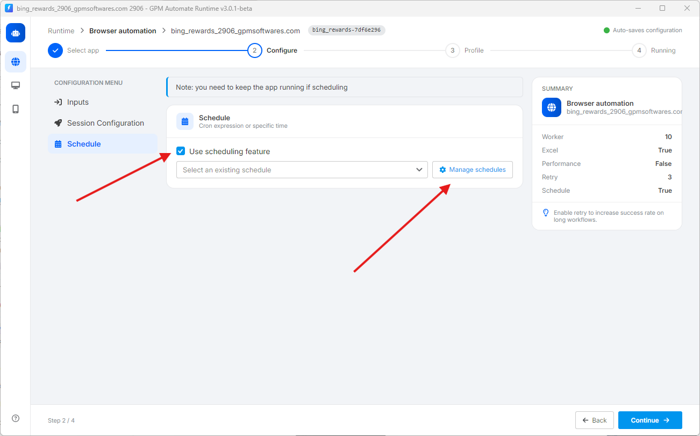
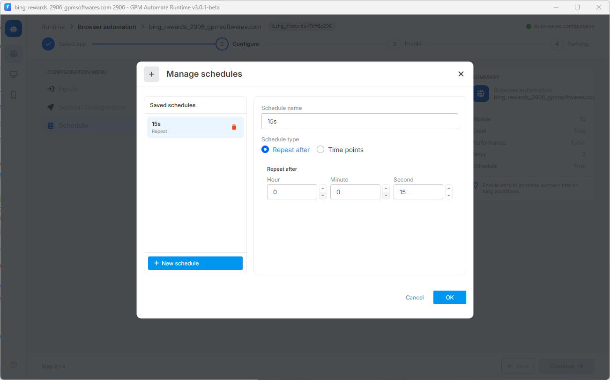
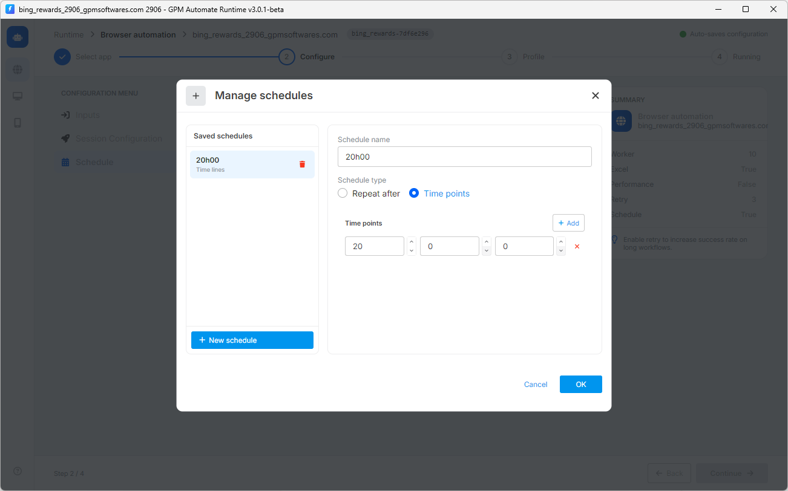

# 📅 5. Schedule（脚本运行定时器）

此功能对于那些想要让工具 24/7 自动运行而不需要手动盯着点击的用户来说非常实用。

🎥 查看更多操作视频教程：[点击这里](https://youtu.be/C8Kf-d9_-sw)。

要使用该功能，请勾选 Use scheduling feature 选项（如下图所示）。

> ⚠️ 重要提示：您必须始终保持 GPM Automate Runtime 软件处于开启状态，定时功能才能生效。如果关闭软件，定时任务将不会运行。

<figure><figcaption></figcaption></figure>

要创建和管理运行时间段，请点击 `⚙️ Manage schedules` 按钮。系统将允许您根据需求设置两种主要的定时方式：

**🔄 类型 1：Repeat after（每隔一段时间循环运行）**

* 运作方式：工具将在您设置的每个时间间隔（时 - 分 - 秒）后自动重新运行脚本。
* 实际示例：如图所示，名为 `15s` 的计划在 Second 项中设置为 `15`。这意味着每隔 15 秒，工具就会自动触发重新运行脚本一次。

<figure><figcaption></figcaption></figure>

**📍 类型 2：Time points（在固定时间点运行）**

* 运作方式：工具将精确对准您在一天中设置的具体时间点，自动启动运行。您可以点击 `+ Add` 按钮来添加多个不同的时间点。
* 实际示例：如图所示，名为 `20h00` 的计划设置的时间点为 `20 : 0 : 0`。这意味着每天正好到 20 点 00 分时，工具将自动打开运行。

<figure><figcaption></figcaption></figure>