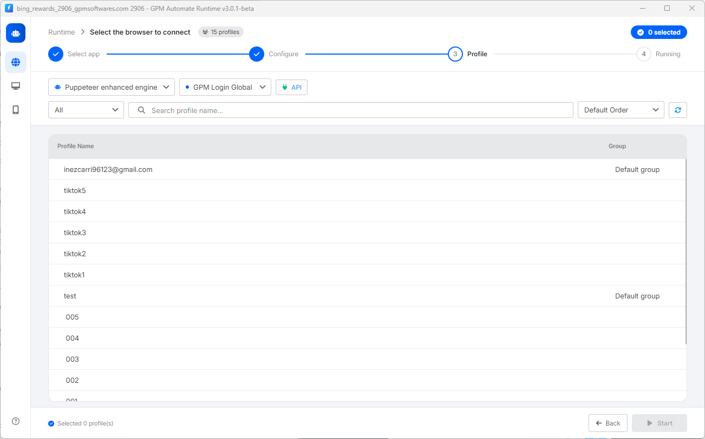

# 👥 6. Profile（选择要运行工具的浏览器 Profile）

在上一步完成配置和计划的设置后，点击 `Continue` 进入第 3 步，即选择要应用脚本的浏览器 Profile（界面如下图所示）。此处的操作包括：

**🤖 1. 选择控制技术和浏览器应用**

查看 Profile 列表上方的菜单栏（如下图），您需要设置：

* 核心技术：根据您的脚本希望使用的技术类型，在 Puppeteer enhanced engine 或 Selenium 之间进行选择，以控制浏览器。
* 浏览器应用：选择您用于管理账号的浏览器类型，例如 GPM Login Global、旧版 GPM Login，或 GoLogin……
* 连接配置：直接点击旁边的 🔌 API 按钮，设置连接到您的 antidetect browser 软件的端口（Port）和路径。

**📁 2. 搜索和筛选 Profile 分组**

* 选择分组（Group）：最左侧的框（当前显示 `All`）可帮助您按各个独立的 Profile 分组快速筛选列表，便于管理。
* 快速搜索：在 `Search profile name...` 框中输入账号名称，即可精确找到需要运行的 Profile，而不必手动滚动鼠标查找。

**🖱️ 3. 快速同时选择多个 Profile 的方法**

要选择需要运行的 Profile，您可以应用以下极快速的操作技巧：

* 手动选择：直接点击每一行 Profile。
* 鼠标拖选：按住鼠标左键并拖动经过各行，以批量选中相邻的多个 Profile。
* 使用 Shift 键：点击选择第一个 Profile，按住 `Shift` 键后再点击选择最后一个 Profile，即可选中中间的整段列表。
* 使用 Ctrl 键：按住 `Ctrl` 键后依次点击分散不相邻的 Profile，以单独选择它们。
* 全选（Ctrl + A）：点击列表区域后按下组合键 `Ctrl + A`，即可选中当前显示的所有 Profile。

> 💡 自动筛选小提示：如果在 Excel 设置步骤（第 2 项）中您已勾选 _Map according to the profile name in column A_ 功能，系统将自动筛选，仅保留名称与您 Excel 文件 A 列数据完全匹配的 Profile。

选择完 Profile 后，右下角的 ▶️ Start 按钮将会亮起。您只需点击它，工具即可正式自动运行。

<figure><figcaption></figcaption></figure>