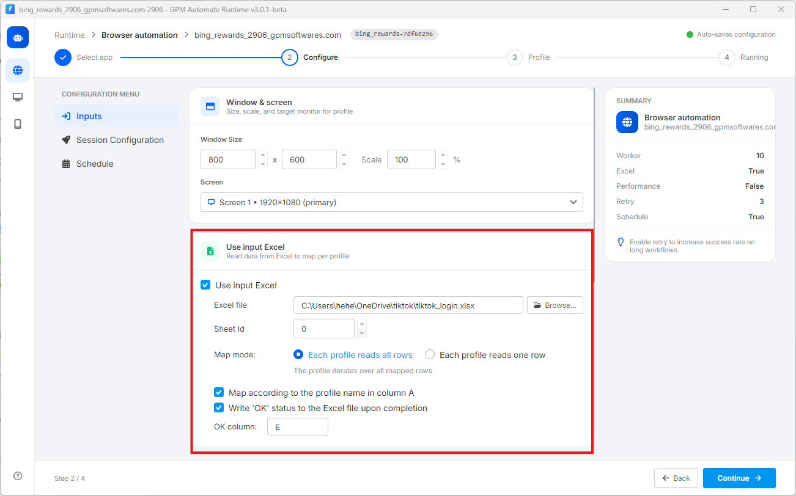

# 📊 2. 关于 Excel 数据配置参数的说明 (Use input Excel)

当您勾选 Use input Excel 后，系统将显示以下详细参数，用于管理数据的读取/写入方式：

* 📂 Excel file：点击 `Browse...` 按钮从您的电脑中选择输入数据文件。系统支持常见的文件格式，如 `.xlsx`、`.xls` 或 `.csv`。
* 📄 Sheet Id：选择您希望工具读取数据的 Excel 文件中工作表（Sheet）的编号。该数值从 `0` 开始计算（对应您 Excel 文件中最左侧的第一个 Sheet）。
* 🔄 Map mode（读取行模式）：此部分决定了浏览器 Profile 获取 Excel 数据的方式：
  * Each profile reads all rows：每个浏览器 Profile 启动后，将依次读取并运行 Excel 文件中的所有数据行。
  * Each profile reads one row：每个浏览器 Profile 仅获取一行数据进行处理（适用于每行代表一个独立账号信息的情况）。
* 🆔 Map according to the profile name in column A：如果勾选此项，工具将自动进行对照：当前正在运行的 GPM Login Profile 名称与 Excel 文件 A 列中某一行的文字相符，则会直接跳转到该行读取数据。
* ✅ Write 'OK' status to the Excel file upon completion：脚本运行完成后，自动在 Excel 文件中写入 'OK' 字样。此功能可帮助您轻松追踪哪一行、哪个账号已被工具成功处理。

<figure><figcaption></figcaption></figure>