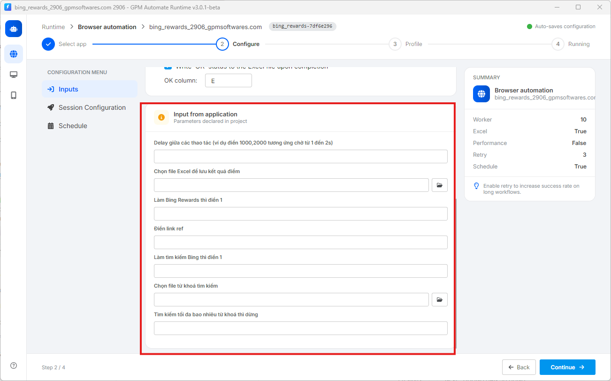

# 📝 3. Input from application(工具编写者对外暴露的配置参数)

这是使用 `.gpmlaunch` 文件时极其方便的部分。脚本编写者在锁定文件时,会故意留出一些空白框,让您根据自己的实际需求自行填写或调整(就像您在下图中看到的界面一样)。

* 运行工具时的注意事项:不同作者的 `.gpmlaunch` 文件在此部分会显示不同的数据输入框(例如:等待时间输入框、结果保存文件选择框,或功能序号输入框等)。因此,打开脚本时,请留意此处有哪些项目需要填写,并按照工具卖家的说明正确填写。

<figure><figcaption></figcaption></figure>