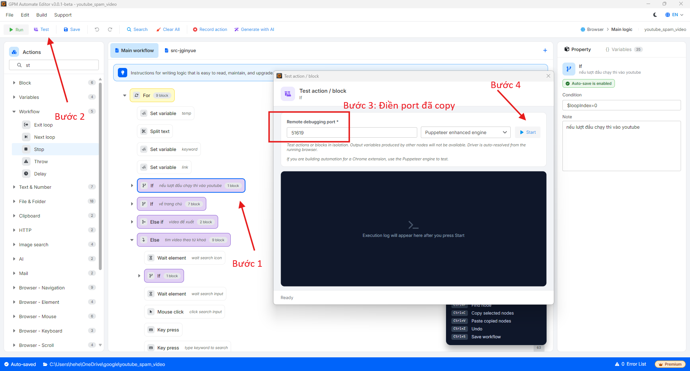

# 🛠️测试 Action 使用指南（测试）

测试（Test）是控制脚本运行流程的重要步骤，它允许您逐步或逐个代码块（Block）运行，以确保在正式运行前一切按预期运作。

🎥 查看更多视频教程：[点击这里](https://youtu.be/zrX3ldxvEDE)。

### 🎯 为什么需要 Test action？

* 错误控制：在执行操作时立即发现并处理问题，而不必从头运行整个脚本。
* 灵活调整：您可以将单个操作或代码块（Block）单独隔离出来进行测试，从而缩短调试时间。
* 边做边测：GPM Automate 支持直接在 GPM Login 的 Profile 上进行测试的机制，让您可以立即在浏览器上观察结果。

> 注意：目前 Test 功能仅支持 GPM Login 中的 Profile。

### ⚙️ 测试执行流程

要开始测试流程，请按照以下步骤操作：

#### 1️⃣ 步骤 1：在 GPM Login 中配置 Profile

* 打开 GPM Login。
* 找到您想用于测试的 Profile。
* 点击 Profile 名称旁边的三个点图标。
* 选择“使用远程端口运行”以获取控制端口参数。

<figure><figcaption></figcaption></figure>

<figure><figcaption></figcaption></figure>

#### 2️⃣ 步骤 2：在 GPM Automate 中设置

* 在 GPM Automate 界面中，选择您想要测试的命令（Action）或代码块（Block）。
* 在上方的工具栏中，点击 Test 按钮。
* 会弹出一个 Test 配置对话框。
* 将步骤 1 中从 GPM Login 获取到的 Port（端口）输入到相应的字段中。
* 点击 Start 开始测试。

<figure><figcaption></figcaption></figure>

#### 3️⃣ 步骤 3：观察结果

* 点击 Start 后，系统会在所选的 Profile 上执行命令。
* 您可以在浏览器窗口以及 GPM Automate 的日志（Log）中实时查看结果，以便根据需要调整脚本。