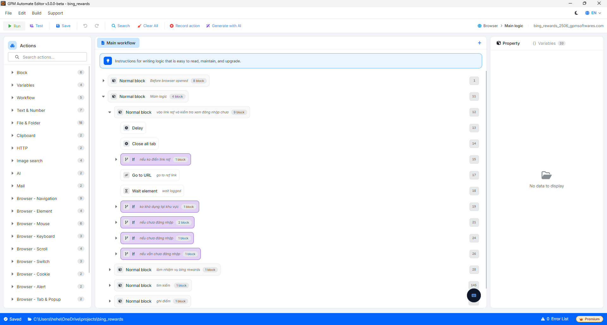
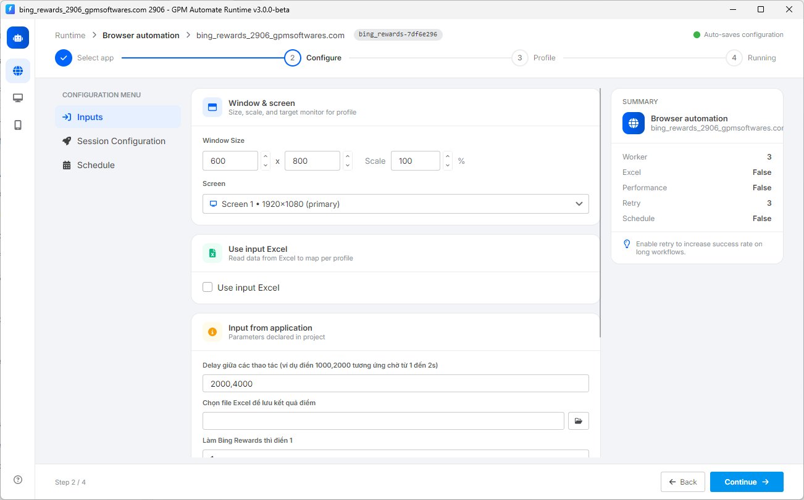

# 🔥GPM Automate 是什么?

#### 🔥 GPM Automate 是什么? 用通俗的话来说

您可以把 GPM Automate 想象成一个帮助电脑自动替您在 GPM Login 浏览器上完成所有工作的工具。您不必亲自动手操作、点击鼠标、敲键盘、滚动页面来做 MMO、Crypto Airdrop、养账号、Dropshipping 等工作，只需要下达指令,让电脑自动在数百个 Profile 上同时批量运行即可。

这套软件分为2个独立的部分,根据您的需求来选择合适的部分:

**🛠️ GPM Automate Editor – 适合想要自己编写工具的人**

* 作用: 这是让您自由创造、设计并拖放各种操作,以按照自己的想法创建自动化脚本(script)的地方。
* 输出: 如果使用免费版,您将导出一个源文件夹(Source Folder)供自己使用。如果使用付费版,您可以将脚本打包成唯一的加密文件 `.gpmlaunch`,以便拿去销售赚钱或分享,而不必担心代码泄露。

<figure><figcaption></figcaption></figure>

**🚀 GPM Automate Runtime – 适合只想运行工具的人 (免费)**

* 作用: 这个运行器没有修改代码的功能。它唯一的任务就是加载脚本,启动它,让其在 GPM Login 的各个 Profile 上自动运行。
* 适用对象: 如果您从他人处购买了 script/`.gpmlaunch` 文件,或在应用商店 [app.gpmautomate.com](https://app.gpmautomate.com) 上购买了它,您只需要使用这个 Runtime 部分打开文件运行即可,不需要关心 Editor 部分。

<figure><figcaption></figcaption></figure>